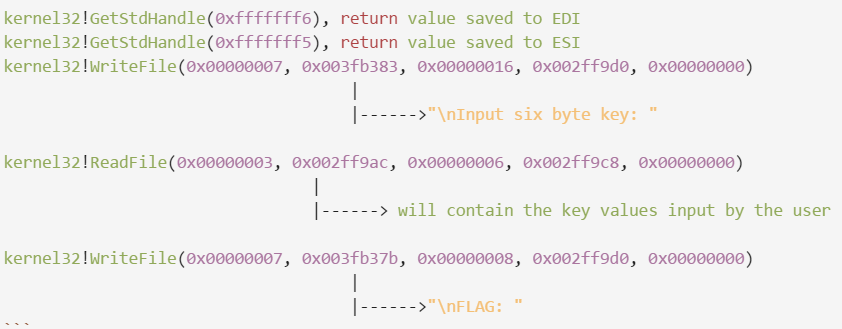
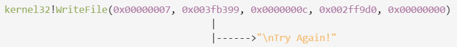

# DRDO CTF 2017 : ReverseEngg-9

**Category:** Reverse Engineering

**Level:** Hard

**Points:** 200

**Solves:** 35

**Description:**

The RED Team developed a binary obfuscation method and applied their obfuscation method to this binary. They challenged the BLUE team that it’s next to impossible to deduce the flag by reversing this binary. The BLUE team took the challenge and using their vast experience, they found out that the RED team has infact used a popular mechanism to hide API calls from static analysis. They are sure that using dynamic analysis and little patience they can win the challenge. Help the BLUE team crack the binary and recover the KEY.

## Write-up

### INTRODUCTION

This problem is based on 2 major concepts:
1. Dynamic unpacking of code
2. Shellcodes

Brief explanation of above concepts:
1. **Dynamic Unpacking of Code:** This is a very simple idea to hinder static analysis. The actual code is encoded/encrypted and stored as a binary data in the executable itself. If an analyst tries to analyze the code, using simple static analysis methods, he will not be able to view the actual useful code.

2. **Shellcodes:** Shellcodes are basically `Position independent code (PIC)` which can be loaded at runtime and executed. The speciality of shellcode is that if not impossible, but it is diffcult to analyze it statically, because generally they resolve APIs at runtime.

### DETAILS

If we run the PE we can see that it asks the user to input a 6-byte flag. If we input any random 6 byte character, it displays the message `Try Again!` and exits. If we open the PE in IDA and try to find the string `Try Again!`, we will fail. The strings shown by IDA are mostly due to MSVC runtime library.

#### Investigating Message Printing on console
The next step we can do is look for API's which prints the message `Try Again!` to the console. If we search for `print` in Imports tab, we get nothing. Then we search for `Write` in the Imports tab, we get 2 APIs namely `WriteConsole`  and `WriteFile`. If we try to determine the functions from where these APIs are called, we will always find that they have been called from some library functions.

#### Investigating Reading User Input
Now if we search for how the program reads input from user, we can search for library functions like `scanf(), getchar(), ReadFile(), ReadConsole()` etc., we will not find any of them in the imports section. So, this definitely gives us a hint that somehow these APIs are resolved and called at runtime.

#### Investigating code

Now if we look at the function `sub_401000()`, we can notice following major things
* Call to VirtualProtect
* A loop after the call to VirtualProtect

If we look at the MSDN documentation for `VirtualProtect()`, we can see that `VirtualProtect()` is used to change the protection on a region of memoory in the calling process.

`VirtualProtect()` accepts 4 parameters
1. lpAddress 	- Pointer to address
2. dwSize    	- size of region of memory
3. flNewProtect - memory protection option
4. lpflOldProtect - pointer to variable that receives the previous access protection

The value of `flNewProtect` (3rd param) is `0x40`, which means `PAGE_EXECUTE_READ_WRITE`.
This is a good indication that `VirtualProtect()` might be trying to load code dynamically. So let's insert a breakpoint in the call to `VirtualProtect()` and find out the `1st (lpAddress)` and `second (dwSize)` parameters.

The address obtained in our case is `0xbb138` and size is `0x210`. Hence, we can assume the code loaded at runtime starts at address `0xbb138` and has a size of `0x210`. At this stage if we try to disassemble at the address `0xbb138`, we will observe that the ASM code does not make any sense. This is an indication that code at that address at this point of time is encoded/encrypted. One might try to analyze how the code is decoded, but in fact there is no need of doing that. At some point of time, the control flow has to jump to the code to execute it, we don't care what happens before it. Given this fact, we will insert a breakpoint at the address of the code and continue execution. But, you will fail to insert a breakpoint on the address at this stage. Why ? If we look at the page protections then we can see that it is `PAGE_READONLY`. If you remember, we have already discused that `VirtualProtect()` is changing the page protections to `PAGE_EXECUTE_READ_WRITE`. So, it means we can insert the breakpoint after completion of execution of `VirtualProtect()` API. Again inserting a software breakpoint will not work here, we need to insert a H/W breakpoint.

#### Analyzing dynamically created code
Once we hit the breakpoint and view the disassembly now, we will see some valid and meaningful instructions. We can try to analyze this code statically, but again that would be cumbersome. At this stage, if we view the ascii of the shellcode, we will be able to view the strings getting printed on the console. Now we know that this code will resolve its APIs at runtime, so now we can focus our analysis only in CALLs to APIs. The basic idea is that we need to step into `CALL` instruction till, we encounter API calls. Once we encounter API calls we need to determine what parameters are passed to the API and what will be the result of calling the API, on the program. This would give us a fairly good idea about the logic of the program.

In the first pass we can idenify the APIs used to write messages to and read input from the console. The sequence of APIs called and the parameters passed to them are following:

After the above API call, the input key will be `XORed` with stored values and the result of first 6 Bytes of `XOR` will be compared to `DRDO@6`
If all the above comparisons succeed, then it will print the "flag" on the screen, using a call to `WriteFile()` for each character of the flag.

* If any byte of the input key is not correct

`FLAG: DRDO@60_{W|nG$_0f_F!r3}_FLAG!`
